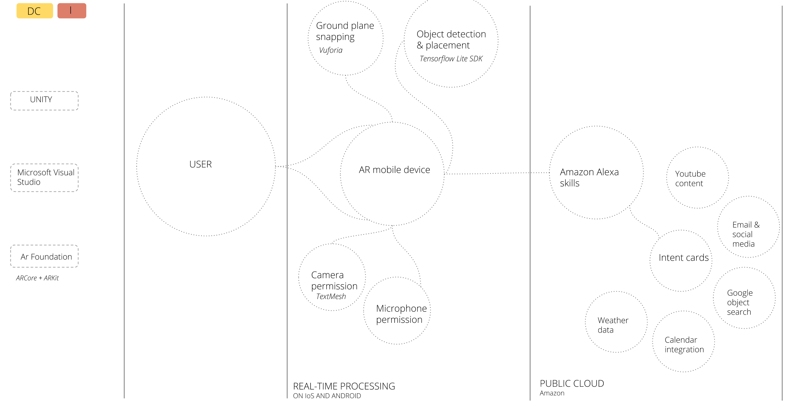

# AR-OFFICE-ASSISTANT
Co-working spaces: plug in to your customized workspace,
an AI Powered AR Character in Unity with AR Foundation.

<B>The aim of this project is to:<B>

Aiming to develop an AR office assistant, the project is centered around exploring core notions about the future development of workspaces, what being a digital nomad means presently and how technology can better assist the users of co-working spaces.

<B>The objectives of this project is to:<B>

MEMORIZE user habits and work patterns

SYNC to calender and assist work-session

PROJECT customized workspace

<B>WORKFLOW:<B>

<B>DATA COLLECTION & LOGGING SETUP<B>

1/Defining SET OF ACTIVITIES to work with

2/Selecting RANGE OF OBJECTS to detect

3/Defining WORKSPACE BOUNDARIES

4/Recording a series of WORKSPACE TASKS

 

5/Performing OBJECT DETECTION on dataset (Darknet Neural network, Yolo + OpenCV)

 

6/Define a workspace boundaries by marking the corners:
Size of the workspace: 800 x 650 mm 

Make a matrix of this bounding surface and define the position of each tracked object in this matrix over time (optical flow)

  

then return for each activity and work patterns 

 

Log work patterns & log anchor points for the working space 

This is the data collection output to Unity. 

<B> AR UNITY APP <B>

Set up main APP framework.

